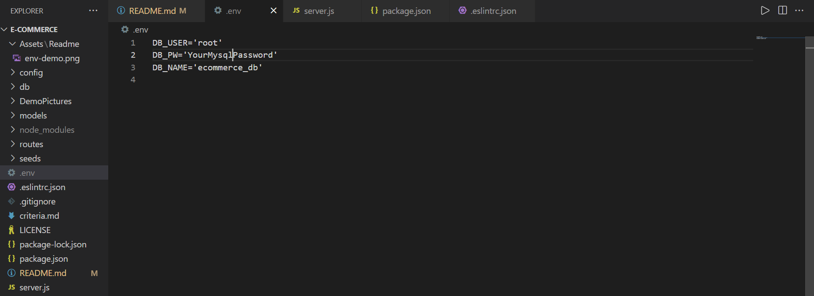

# E-Commerce Backend

[](https://opensource.org/licenses/MIT)    


## General Information
 
* [Walkthrough Video E-Commerce Backend Application]()

* [GitHub repository of E-Commerce Backend Application](https://github.com/ZahraMertens/E-commerce-backend.git)


## Table of Contents
1. [General Information](#general-information)
2. [Task Description](#task-description)
3. [Installation Instructions](#installation-instructions)
5. [Technologies Used](#technologies-used)
6. [User Story](#user-story)
7. [Actual Behaviour](#actual-behaviour)
8. [Bonus](#bonus)
9. [Mock-Up](#mock-up)
10. [Credits](#credits)


## Task Description

The Application "E-commerce-Backend" is the backend part powered by express.js and sequelize to interact with the retailers database. The task is made to understand the fundamental architecture of e-commerce platforms in order to become a full stack web developer. The application allows the user to perform different request on the database to get categories, products and its product tags as well as update, and delete data from the database. As the application represents only the backend of the retailers webpage we can use the code with Insomnia in order to perform the previously named methods.

## Installation Instructions

* 1️⃣ First the user must clone the [GitHub Repo](https://github.com/ZahraMertens/E-commerce-backend.git) on its computer.

* 2️⃣ Open the repository on your device with VS Code (or any other program)

* 3️⃣ Open the command line at the folder location OR the integrated terminal 

* 4️⃣ First, you MUST install the npm packages by running "npm install" in the terminal

* 5️⃣ You also have to install MySql and create an account in order to be able to interact with the database

   * You then need to login to mysql on the command line by running the 'mqsql -u root -p' command and run SOURCE schema.sql and SOURCE seeds.sql to initialize the database

* 6️⃣ In order to be able to interact with the database out of mysql, the user must install the npm package "sequelize" to build a connection between the database and the server

* 7️⃣ The user must also download Insomnia or postman to be able to perform the request without the frontend

* 8️⃣ To protect your personal data you need to create a ".env" file in the root of the repository, which includes your mysql password, the database name, and the user such as:  

* 9️⃣ The user must start the server in local host by runnding "npm start" and can then perform request in insomnia

## Technologies Used

* JavaScript

* Node.JS

* Npm packages: Express, mysql2, sequelize & dotenv

## User Story

```
AS A manager at an internet retail company
I WANT a back end for my e-commerce website that uses the latest technologies
SO THAT my company can compete with other e-commerce companies
```

## Actual Behaviour

* WHEN I add my database name, MySQL username, and MySQL password to an environment variable file THEN I am able to connect to a database using Sequelize

* WHEN I enter schema and seed commands THEN a development database is created and is seeded with test data

* WHEN I enter the command to invoke the application THEN my server is started and the Sequelize models are synced to the MySQL database

* WHEN I open API GET routes in Insomnia Core for categories, products, or tags THEN the data for each of these routes is displayed in a formatted JSON

* WHEN I test API POST, PUT, and DELETE routes in Insomnia Core THEN I am able to successfully create, update, and delete data in my database


## Bonus


## Mock-Up

🎥 The GIF shows the command line application and the functionality:


## Credits

* 


© 2021 Zahra Mertens, E-commerce-backend